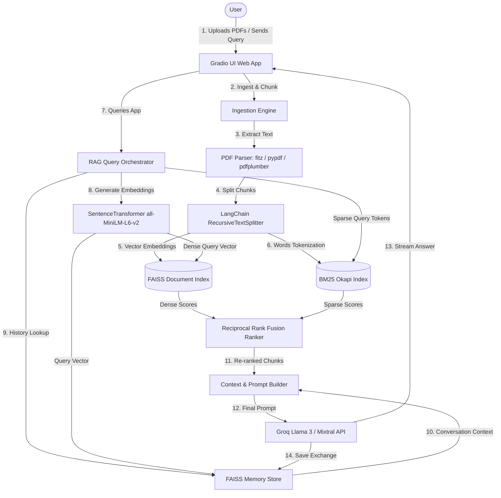

# Architecture & System Design Documentation

This document describes the high-level architecture, design decisions, and data flows of the **Quick Hopper Hybrid RAG System**.

---

## 1. High-Level Architecture

The Quick Hopper application is a Retrieval-Augmented Generation (RAG) system optimized for speed, cost, and high context-relevance. It utilizes local embeddings (`all-MiniLM-L6-v2`), a local hybrid search index (combining dense vector search with sparse keyword search), a vector-based conversational memory store, and a local offline model to analyze negative user feedback.

---

## 2. Core Subsystems

### A. Incremental Ingestion & Parsing Subsystem
- **Parser Pipeline**: Resolves PDF text extraction using a cascading fallback hierarchy:
  1. **PyMuPDF (`fitz`)**: Primary parser; fastest and highly accurate.
  2. **`pypdf`**: Secondary parser; handles standard PDF streams.
  3. **`pdfplumber`**: Tertiary fallback; robust table and layout extraction.
- **Recursive Chunking**: Splits extracted text using LangChain's `RecursiveCharacterTextSplitter` with `chunk_size=1000` and `chunk_overlap=200`, ensuring clean semantic boundaries.
- **Incremental Indexing**: Detects and skips already processed filenames to prevent redundant computations.

### B. Hybrid Search & Ranking Subsystem
Dense semantic matching is powerful but struggles with exact acronyms, dosage strings, or serial numbers. Sparse search excels at keywords but misses semantic intent. Quick Hopper integrates both:
1. **Dense Retrieval (FAISS)**: Uses cosine similarity (approximated via L2 distance mapping) over 384-dimensional `all-MiniLM-L6-v2` embeddings.
2. **Sparse Retrieval (BM25)**: Utilizes the `rank_bm25` (BM25Okapi implementation) to index lexical tokens.
3. **Reciprocal Rank Fusion (RRF)**: Merges dense and sparse ranks into a single, re-ranked candidate list using the standard RRF formula:
   $$RRF\_Score(d) = \sum_{m \in M} \frac{1}{k + r_m(d)}$$
   where $M = \{Dense, Sparse\}$, $r_m(d)$ is the rank of document $d$ in retriever $m$, and $k$ is a constant (typically $60$).

### C. Conversational Vector Memory Subsystem
To maintain conversation continuity without causing LLM token bloat:
- past QA turns are concatenated: `"User: {query} \n Assistant: {answer}"`.
- The string is embedded and saved in a persistent FAISS index (`memory_index.faiss`) and a metadata store (`memory_store.json`).
- Upon receiving a new query, the database retrieves the top $2$ semantically related historical turns to inject as past context, keeping prompts compact and contextually relevant.

### D. Offline Feedback Classifier Subsystem
To avoid Groq API token usage and maintain private processing:
- Users vote 👍/👎 on Gradio chatbot outputs.
- A **`FeedbackAnalyzerModel`** is trained offline using a local dataset containing 580 pharma-specific Q&A patterns.
- It maps the user's negative feedback to **7 pharmaceutical-specific weak spot categories**:
  - `pitch_clarity`: Vague, off-brand, or missing clinical value propositions.
  - `failure_mode`: Misleading claims or missing known failure risks.
  - `evidence_missing_or_overstated`: Lacks clinical evidence or overstates strength.
  - `safety_gap`: Omits critical safety warnings, warnings, or adverse effects.
  - `unsafe_comparison`: Direct competitor comparisons without qualifications.
  - `analysis_signal`: Missing analytical depth or meta-pattern cross-reference.
  - `policy_violation`: Off-label promotion or regulatory policy issues.
- **Classification Method**: Nearest-neighbor search against trained vector anchors, falling back to a local regex heuristic when confidence is low.
