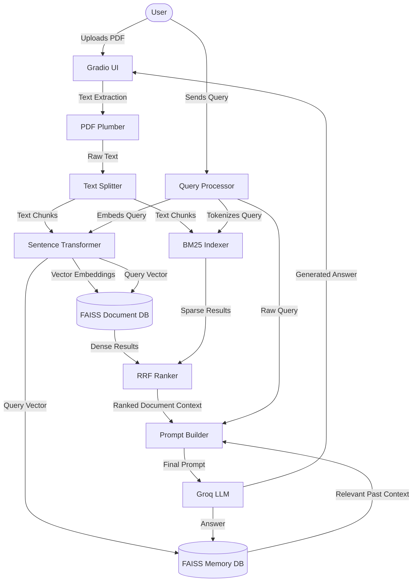

# 🚀 Hybrid RAG Workspace (Quick Hopper)

An advanced, production-grade **Retrieval-Augmented Generation (RAG)** workspace featuring **Hybrid Retrieval** (Dense + Sparse) and **Vector-based Persistent Conversational Memory**. Designed with a clean, responsive Gradio interface and optimized for lightning-fast inference using Groq API.

---

### 🔗 Live Deployments

> [!IMPORTANT]
> Use the links below to access the live application hosted on Hugging Face Spaces:
> * **Direct Application Link (Full-Screen & Fast)**: 🌐 **[https://eshaan-eshaan-hybrid-rag-workspace.hf.space](https://eshaan-eshaan-hybrid-rag-workspace.hf.space)**
> * **Hugging Face Space Dashboard**: 🤗 **[https://huggingface.co/spaces/eshaan-eshaan/Hybrid-Rag_Workspace](https://huggingface.co/spaces/eshaan-eshaan/Hybrid-Rag_Workspace)**

---

## 💡 What Problem This Solves

| Challenge in Standard RAG | How Hybrid RAG Workspace Solves It |
| :--- | :--- |
| **Missed Keyword & Acronym Matches** | Integrates **Sparse Search (BM25)** alongside **Dense Search (FAISS)**. Merges outputs using **Reciprocal Rank Fusion (RRF)** to get semantic meaning *and* exact keyword matching. |
| **Context Window Exhaustion** | Avoids bloating LLM prompts with complete historical chat transcripts. Stores conversational history as vectors in a persistent **FAISS Memory Store**, retrieving only relevant turns. |
| **Empty-State Failures** | Implements a robust fallback mechanism using a built-in RAG knowledge base (`DEFAULT_CHUNKS`) if the user starts querying without uploading any custom PDF. |
| **Server Crash on Large Contexts** | Optimizes text splitting parameters (`chunk_size=1000`, `chunk_overlap=200`, `top_k=8`) ensuring comprehensive lists and contexts are extracted without truncating. |

---

## 🛠️ Tech Stack & Architecture

### Core Technologies
* **Frontend UI**: [Gradio](https://gradio.app/) (Version 4.44.0)
* **LLM Provider**: [Groq API](https://groq.com/) (Llama 3 / Mixtral models)
* **Dense Vector Database**: [FAISS](https://faiss.ai/) (Facebook AI Similarity Search)
* **Sparse Search Engine**: `rank_bm25` (BM25Okapi)
* **Embeddings Model**: `SentenceTransformer` (`all-MiniLM-L6-v2` ~90MB)
* **Document Parser**: `pdfplumber` (High-fidelity text extractor)
* **Text Segmenter**: `langchain_text_splitters.RecursiveCharacterTextSplitter`

### Dual-Index Memory Design
The workspace utilizes two completely isolated, parallel indexes:
1. **Document Index (Volatile)**: Stores text chunks of the currently uploaded PDF. Cleared upon new uploads.
2. **Memory Index (Persistent)**: Encodes past conversation turns (user queries + assistant replies) to local storage files (`memory_index.faiss` and `memory_store.json`), serving as a semantic memory layer.

---

## 🗺️ Data Flow Architecture (DFD)



---

## 📋 How It Works (Step-by-Step)

```
[ PDF Upload ] ──> [ Extract Text ] ──> [ Chunking ] ──> [ Dense Embeddings (FAISS) ]
                                                      └─> [ Sparse Tokenization (BM25) ]
                                                      
[ User Query ] ──> [ Dense & Sparse Search ] ──> [ Reciprocal Rank Fusion (RRF) ] ──┐
             └───> [ Memory Search ] ──────────> [ Semantic Memory Retrieval ] ─────┼─> [ Groq LLM ] ──> [ UI Stream Response ]
                                                                                   │
                                                   [ Save Conversation State ] ────┘
```

1. **Ingestion**: PDF pages are parsed. The text is split into overlapping chunks, which are indexed into the FAISS dense database and the BM25 sparse index.
2. **Retrieval**: When a query is entered, the engine runs a dual-search. FAISS evaluates semantic similarity; BM25 evaluates exact keyword matching.
3. **Fusion**: Reciprocal Rank Fusion (RRF) scores and merges both lists, producing the most relevant context blocks.
4. **Memory Injection**: The query checks the local conversation memory store. Relevant historical facts are fetched and merged into the prompt.
5. **Generation**: Groq LLM processes the unified prompt (Retrieved Chunks + Semantic Memory + Query) and streams the answer back to the interface.
6. **Persistence**: The conversation turn is converted into embeddings and saved back to the persistent local FAISS memory.

---

## 📂 Project Directory Structure

```text
quick-hopper/
│
├── .env                       # Local secrets (GROQ_API_KEY) [Ignored by Git]
├── .env.example               # Template for environment configuration
├── app.py                     # Main application entry point & Gradio UI
├── hybriidrag.py              # Sandbox backend logic and terminal prototyping
├── feedback_model.py          # Local analyzer model for user feedback logs
├── pharma_query_bank_300.csv  # Pre-compiled training dataset for local analyzer
├── requirements.txt           # Cloud deployment dependency manifest
├── README.md                  # Beautifully formatted documentation
│
└── Data Storage (Auto-Generated)
    ├── memory_index.faiss     # Local FAISS index for conversation memory
    └── memory_store.json      # Metadata mapping for conversation memory
```

---

## ⚙️ Running Locally

1. **Clone the Repository**:
   ```bash
   git clone https://github.com/eshaan-eshaan/Hybrid-Rag_Workspace.git
   cd Hybrid-Rag_Workspace
   ```

2. **Install Dependencies**:
   ```bash
   pip install -r requirements.txt
   ```

3. **Configure Environment Variables**:
   Create a `.env` file in the root folder:
   ```env
   GROQ_API_KEY="your_groq_api_key_here"
   ```

4. **Launch the Server**:
   ```bash
   python app.py
   ```
   Open your browser and navigate to `http://127.0.0.1:8080`.
